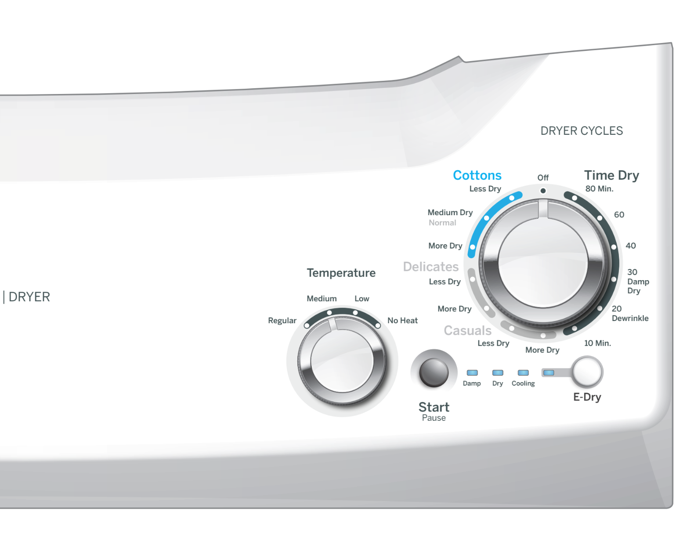

# User Interface Controls Specification (Dryer)

This document describes the available user interface controls, indicators, and cycle selections for the Dryer product.

---

# Cycle Selector

The cycle selector is implemented through a rotary knob that allows the user to choose the desired drying program. Each position corresponds to a predefined cycle profile and drying level.

## Cottons - Less Dry Cycle

The **Cottons - Less Dry Cycle** is a knob-selectable option identified on the user interface panel as **"Cottons / Less Dry"**.

When selected, the dryer applies a gentle drying profile designed for cotton garments while maintaining a lower dryness target.

**Control Type:** Knob Option

**Available States:**
- Active
- Inactive

**Expected Action:**
Configures gentle drying for cotton garments.

**Acceptance Criteria:**
When selected, the system applies the Cottons profile with the Less Dry level.

---

## Cottons - Medium Dry / Normal Cycle

The **Cottons - Medium Dry / Normal Cycle** is identified on the panel as **"Cottons / Medium Dry Normal"**.

This option provides standard drying performance for cotton garments and represents the default dryness target for typical loads.

**Control Type:** Knob Option

**Available States:**
- Active
- Inactive

**Expected Action:**
Configures normal drying for cotton garments.

**Acceptance Criteria:**
When selected, the system applies the Cottons profile with the Medium Dry level.

---

## Cottons - More Dry Cycle

The **Cottons - More Dry Cycle** is identified on the panel as **"Cottons / More Dry"**.

This cycle increases the drying intensity to achieve a higher dryness level for cotton garments.

**Control Type:** Knob Option

**Available States:**
- Active
- Inactive

**Expected Action:**
Configures intensive drying for cotton garments.

**Acceptance Criteria:**
When selected, the system applies the Cottons profile with the More Dry level.

---

## Delicates - Less Dry Cycle

The **Delicates - Less Dry Cycle** is identified on the panel as **"Delicates / Less Dry"**.

This cycle provides gentle drying conditions intended to protect delicate fabrics while achieving a light dryness level.

**Control Type:** Knob Option

**Available States:**
- Active
- Inactive

**Expected Action:**
Configures gentle drying for delicate garments.

**Acceptance Criteria:**
When selected, the system applies the Delicates profile with the Less Dry level.

---

## Delicates - More Dry Cycle

The **Delicates - More Dry Cycle** is identified on the panel as **"Delicates / More Dry"**.

This option applies a more aggressive drying target while maintaining the Delicates cycle profile.

**Control Type:** Knob Option

**Available States:**
- Active
- Inactive

**Expected Action:**
Configures intensive drying for delicate garments.

**Acceptance Criteria:**
When selected, the system applies the Delicates profile with the More Dry level.

---

## Casuals - Less Dry Cycle

The **Casuals - Less Dry Cycle** is identified on the panel as **"Casuals / Less Dry"**.

This option provides reduced dryness for everyday casual garments.

**Control Type:** Knob Option

**Available States:**
- Active
- Inactive

**Expected Action:**
Configures gentle drying for casual clothing.

**Acceptance Criteria:**
When selected, the system applies the Casuals profile with the Less Dry level.

---

## Casuals - More Dry Cycle

The **Casuals - More Dry Cycle** is identified on the panel as **"Casuals / More Dry"**.

This option applies a higher drying target while maintaining the Casuals cycle profile.

**Control Type:** Knob Option

**Available States:**
- Active
- Inactive

**Expected Action:**
Configures intensive drying for casual clothing.

**Acceptance Criteria:**
When selected, the system applies the Casuals profile with the More Dry level.

---

# Timed Dry Cycles

The Timed Dry group provides fixed-duration drying programs that operate independently of moisture sensing algorithms.

## Time Dry - 80 Min. Cycle

The **80 Minute Timed Dry Cycle** is identified as **"Time Dry / 80 Min."** and provides a fixed-duration drying operation.

**Expected Action:**
Configures a fixed 80-minute drying cycle.

**Acceptance Criteria:**
When selected, the timer is set to 80 minutes.

---

## Time Dry - 60 Min. Cycle

The **60 Minute Timed Dry Cycle** is identified as **"Time Dry / 60 Min."**.

**Expected Action:**
Configures a fixed 60-minute drying cycle.

**Acceptance Criteria:**
When selected, the timer is set to 60 minutes.

---

## Time Dry - 40 Min. Cycle

The **40 Minute Timed Dry Cycle** is identified as **"Time Dry / 40 Min."**.

**Expected Action:**
Configures a fixed 40-minute drying cycle.

**Acceptance Criteria:**
When selected, the timer is set to 40 minutes.

---

## Time Dry - 30 Damp Dry Cycle

The **30 Minute Damp Dry Cycle** is identified as **"Time Dry / 30 Damp Dry"**.

This cycle is intended to leave garments slightly damp for easier ironing or post-processing.

**Expected Action:**
Configures a 30-minute damp-dry cycle.

**Acceptance Criteria:**
When selected, the system applies the Damp Dry profile with a duration of 30 minutes.

---

## Time Dry - 20 Dewrinkle Cycle

The **20 Minute Dewrinkle Cycle** is identified on the panel as **"Time Dry / 20 Dewrinkle"**.

This cycle is intended to reduce wrinkles in previously dried garments.

**Expected Action:**
Configures a 20-minute wrinkle-release cycle.

**Acceptance Criteria:**
When selected, the system applies the Dewrinkle profile with a duration of 20 minutes.

---

## Time Dry - 10 Min. Cycle

The **10 Minute Timed Dry Cycle** is identified as **"Time Dry / 10 Min."**.

**Expected Action:**
Configures a quick 10-minute drying cycle.

**Acceptance Criteria:**
When selected, the timer is set to 10 minutes.

---

# Temperature Selector

The Temperature Selector is implemented through a dedicated rotary knob labeled **"Temperature"**.

The user can select one of four available heat settings before starting the cycle. Only one temperature level can be active at any given time.

**Available Settings:**
- Regular
- Medium
- Low
- No Heat

**Acceptance Criteria:**
The selected temperature level shall be recorded by the system before cycle execution.

## Regular Temperature

Applies the standard high-heat drying profile.

## Medium Temperature

Applies a medium-heat drying profile.

## Low Temperature

Applies a low-heat drying profile.

## No Heat Temperature

Disables all heating functions and operates using ambient air only.

---

# Primary Controls

## Start / Pause Button

The **Start / Pause Button** is the primary user control used to start, pause, and resume the drying process.

**Control Type:** Primary Button

**Available States:**
- Ready
- Running
- Paused
- Completed

**Expected Action:**
Starts, pauses, or resumes the active drying cycle.

**Acceptance Criteria:**
With a valid configuration selected, pressing Start begins the cycle. During operation, pressing the button pauses execution while retaining all current settings.

---

# Status Indicators

The dryer uses dedicated status indicators to communicate the active phase of the drying process.

## Damp Indicator

The **Damp Indicator** is identified by the label **"Damp"**.

When illuminated, the system is operating within the damp-dry stage.

**Available States:**
- On
- Off

**Acceptance Criteria:**
The indicator is active only during the Damp phase.

---

## Dry Indicator

The **Dry Indicator** is identified by the label **"Dry"**.

When illuminated, the system is operating within the primary drying stage.

**Available States:**
- On
- Off

**Acceptance Criteria:**
The indicator is active only during the Dry phase.

---

## Cooling Indicator

The **Cooling Indicator** is identified by the label **"Cooling"**.

When illuminated, the system is operating within the cooling stage.

**Available States:**
- On
- Off

**Acceptance Criteria:**
The indicator is active only during the Cooling phase.

---

# Energy Saving Function

## E-Dry Control

The **E-Dry Control** enables the energy-saving operating mode of the dryer.

**Control Type:** Lever / Toggle

**Available States:**
- Enabled
- Disabled

**Expected Action:**
Activates energy-efficient drying operation.

**Acceptance Criteria:**
When enabled, the visual indication changes and the cycle configuration includes E-Dry mode.

---

