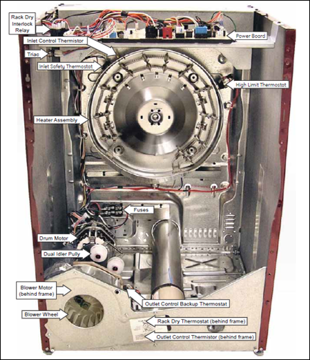
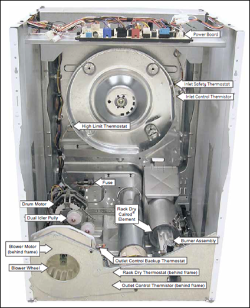
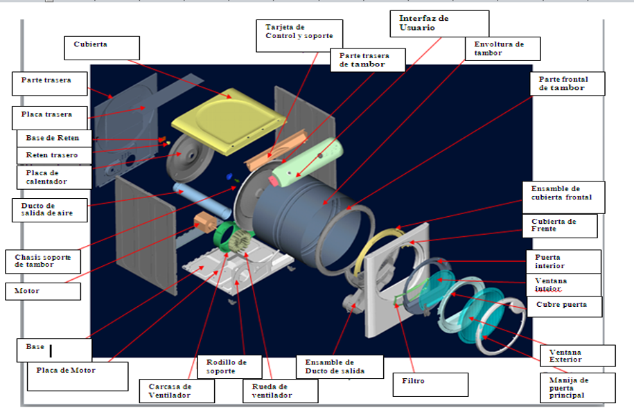

# Electric Dryer and Gas Dryer Comparation

## Electric Dryer Operation

| Item | Description |
|--------|-------------|
| Air Inlet | Air enters from outside the cabinet through louvers and available openings. |
| Heating Process | Air passes through the electric heating element where it is heated. |
| Drum Air Flow | Hot air enters the drum to evaporate moisture from the clothes. |
| Moisture Removal | Moist air passes through the lint filter and trap duct while being extracted from the drum. |
| Exhaust | Air exits the system through the exhaust duct. |

---

## Gas Dryer Operation

| Item | Description |
|--------|-------------|
| Air Inlet | Air enters from outside the cabinet through louvers and available openings. |
| Heating Process | Air is heated by gas combustion inside the combustion chamber. |
| Air Mixing | Fresh air and heated air are mixed before passing through the gas diffuser. |
| Drum Air Flow | Heated air enters the drum to evaporate moisture from the clothes. |
| Moisture Removal | Moist air passes through the lint filter and trap duct while being extracted from the drum. |
| Exhaust | Air exits the system through the exhaust duct. |

---

# Heat Control Comparison

| Electronic Dryer | Mechanical / Gas Dryer |
|-----------------|------------------------|
| Inlet Thermistor | Inlet Thermostat |
| Outlet Thermistor | Safety Thermostat |
| Safety Thermostat | Outlet Thermostat |
| Outlet Thermostat | Hi-Limit Thermostat |
| Hi-Limit Thermostat | |

---

# Moisture Sensing Comparison

| Electronic Dryer | Mechanical / Gas Dryer |
|-----------------|------------------------|
| Sensor Rods (Metal Bars) | Timer |
| | Safety Thermostat |
| | Outlet Thermostat |

---

# Noise Parameters

| Category | Parameter |
|-----------|-----------|
| Exhaust Restrictions | Long Exhaust Ducts |
| Exhaust Restrictions | Ducts with Elbows/Bends |
| Exhaust Restrictions | Lint Accumulation |
| Exhaust Restrictions | Dirty Lint Filter |
| Exhaust Restrictions | Moisture Recirculation |
| Load Size | Very Large Loads |
| Load Size | Bulky Loads |
| Load Size | Single Item or Very Light Loads |
| Fabric Type | Synthetic Fabrics |
| Fabric Type | Cotton |
| Fabric Type | Polyester/Cotton Blend |
| Fabric Type | Lycra / Spandex |
| Fabric Type | Sportswear |
| Fabric Type | Mixed Fabric Loads |

### Notes

- More restricted exhaust systems increase drying time.
- Larger loads increase drying time.
- A greater combination of fabric types makes drying prediction more difficult.

---

# Dryer Process Flow

## Electric Dryer Process

1. Air enters the dryer from the environment.
2. Air passes through the electric heating element.
3. Air is heated to the required temperature.
4. Heated air enters the drum.
5. Moisture evaporates from the clothes.
6. Moist air exits the drum.
7. Air passes through the lint filter.
8. Air flows through the trap duct.
9. Air is exhausted outside the appliance.

---

## Gas Dryer Process

1. Air enters the dryer from the environment.
2. Gas combustion generates heat inside the combustion chamber.
3. Heated air mixes with fresh air.
4. Mixed air passes through the gas diffuser.
5. Heated air enters the drum.
6. Moisture evaporates from the clothes.
7. Moist air exits the drum.
8. Air passes through the lint filter.
9. Air flows through the trap duct.
10. Air is exhausted outside the appliance.

---

# Dryer Components

## Rear Heat Configuration

- Cabinet
- Drum
- Rear Bulkhead
- Front Bulkhead
- Electric Heater Assembly
- Burner Assembly (Gas Models)
- Combustion Chamber
- Gas Diffuser
- Blower Wheel
- Blower Housing
- Trap Duct
- Lint Filter
- Exhaust Duct
- Drive Motor
- Drive Belt
- Idler Pulley
- Inlet Thermistor
- Outlet Thermistor
- Inlet Thermostat
- Outlet Thermostat
- Safety Thermostat
- Hi-Limit Thermostat
- Moisture Sensor Rods
- Control Board
- User Interface Assembly
- Door Assembly
- Air Inlet Louvers

