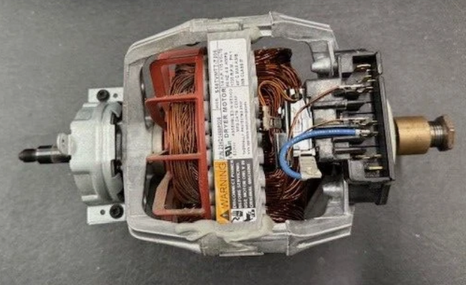
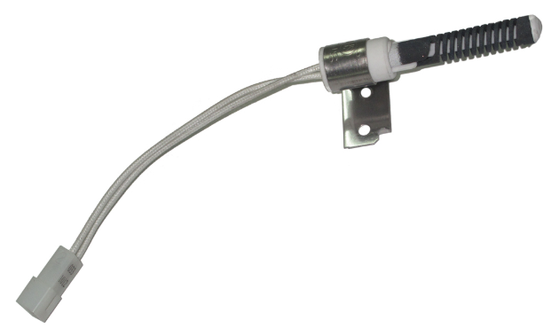
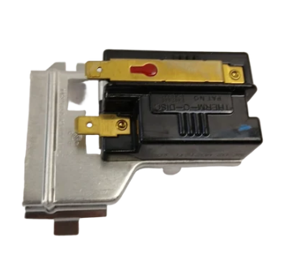
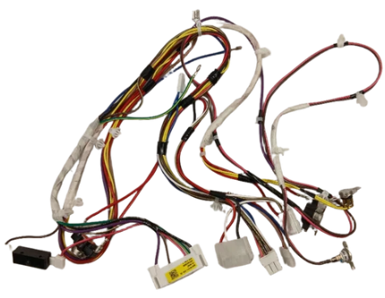
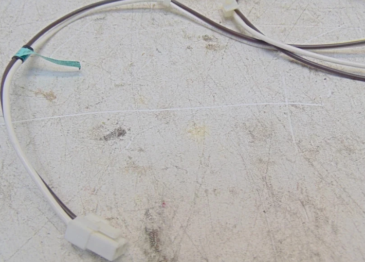
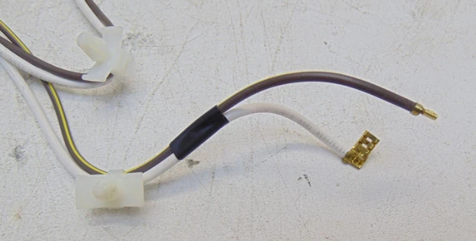
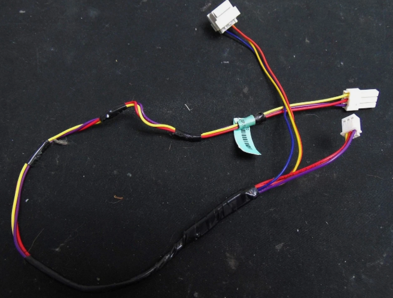

# **Gas Dryer Requirements**

# Inlet Control Thermistor

## Requirements
On start key release, the SSD should reflect the inlet/outlet temperature. The drum motor should start, and the corresponding coil should turn on (gas units just turn on the heat). Opening the dryer door or deselecting the test will turn off the drum and heaters.

### No. Part
- **559C259G003**

---

# Outlet Control Thermistor

## Requirements
On start key release, the SSD should reflect the inlet/outlet temperature. The drum motor should start, and the corresponding coil should turn on (gas units just turn on the heat). Opening the dryer door or deselecting the test will turn off the drum and heaters.

### No. Part
- **559C259G003**

---

# Gas Valve Coils
## Requirement
The Gas Valve Coils shall receive control commands from the Main Control Board to actuate the Gas Valve and permit gas flow to the burner only when heating is requested and all required operating and safety conditions are satisfied. The coils shall de-energize immediately when heating is terminated or a fault condition is detected, preventing unintended gas flow.

### No. Part
- 234D3046P001

# Gas Valve
## Requirement
The Gas Valve shall permit gas flow to the dryer burner only when actuated by the Gas Valve Coils. The valve shall provide a controlled gas path for burner operation and shall immediately stop gas flow when coil energization is removed, preventing unintended gas delivery and supporting safe dryer heating operation.

### No. Part
- 234D3046P001

---

# Door Switch
## Requirement
The Door Switch system shall protect the user by continuously monitoring the dryer door status and providing open and closed state feedback to the control; the control shall verify that the door is closed before allowing cycle initiation, immediately respond to a door opening event during operation by disabling functions that require a closed-door condition, maintain accurate door status monitoring throughout the cycle, and prevent operation whenever an unsafe door-open condition exists, ensuring safe dryer operation and user access protection. 

### No. Part
- 248C1157P001

---

# Dryer Drive Motor
## Requirement
The Dryer Drive Motor system shall provide drum rotation and airflow generation throughout the drying process by receiving motor enable commands from the Main Control, driving the drum and blower assembly at the required operating speed, transitioning the internal centrifugal switch from start to run operation, enabling heat source operation only after valid motor rotation has been established, shutting down when cycle completion or interruption conditions occur, and maintaining safe operation through automatic overload protection whenever abnormal motor loading or overheating conditions are detected.

### No. Part
- **234D1469P008**

---

# Ignitor 
## Requirement
The Igniter system shall initiate burner ignition by generating sufficient thermal energy to reach the required ignition temperature before gas admission is permitted; the Main Control shall energize the igniter during a heating request, maintain ignition power until proper ignition conditions are achieved, and coordinate igniter operation with flame detection and gas valve sequencing to ensure safe and reliable burner ignition during each heating cycle.

### No. Part
- **248C1186P002**

---

# Flame Detector
## Requirement
The Flame Detector system shall provide ignition status verification by monitoring radiant heat generated by the igniter and burner flame, transitioning from its normal state when ignition conditions are achieved, supplying feedback required for gas valve actuation, maintaining ignition validation while combustion is present, and preventing continuation of the burner ignition sequence whenever valid flame detector transitions are not detected within the expected operating period.

### No. Part
- **109B8868G001**

---

# Harness Elec ASM
## Requirement
The system shall provide electrical connectivity between the main control board and the lid lock assembly to enable lid status monitoring and lid locking functions during operation.

### NO.Part
- **234D2622G004** si existe

---

# Harness Door ASM
## Requirement
The system shall provide electrical connectivity between the main control board and the door switch assembly to enable door status monitoring during dryer operation.

### NO.Part
- **189D7183G003** si existe

---

# Harness Comunication ASM
## Requirement
The system shall provide electrical connectivity between the user interface and the control system to support command and status communication.

### NO.Part
- **234D2640G002** si existe 

---

# Harness Gas ASM
## Requirement
The system shall provide electrical connectivity between the main control board and the gas heating system, including ignition, flame detection, and gas valve control components.

### NO.Part
- **234D2639G005**

---

# Safety Thermostat
## Requirement
The Safety Thermostat system shall protect the appliance from abnormal heating conditions, interrupting power to the heating source whenever the calibrated safety threshold is exceeded, maintaining protection throughout the overheating condition, and automatically restoring operation only after the temperature has returned within the defined safe operating range.

### No. Part

---

# Outlet Control Thermostat
## Requirement
The Outlet Control Thermostat shall regulate drying performance by monitoring outgoing airflow temperature and controlling heat source operation to maintain the required drying temperature profile; the thermostat shall interrupt heating when the defined outlet temperature threshold is exceeded and automatically restore heating operation once outlet temperature returns to the acceptable operating range.

### No. Part

---

# High Limit Thermostat
## Requirement
The High Limit Thermostat system shall provide secondary thermal protection for the dryer by monitoring critical temperature conditions near the heating source, interrupting motor operation whenever temperatures exceed the maximum allowable safety limit, preventing continued operation under hazardous overheating conditions, and automatically restoring operation only after temperature levels return below the thermostat reset threshold.

### No. Part
- ****

---