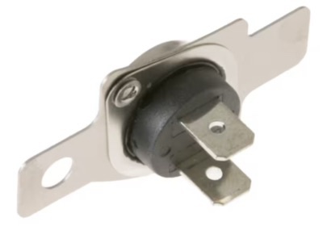
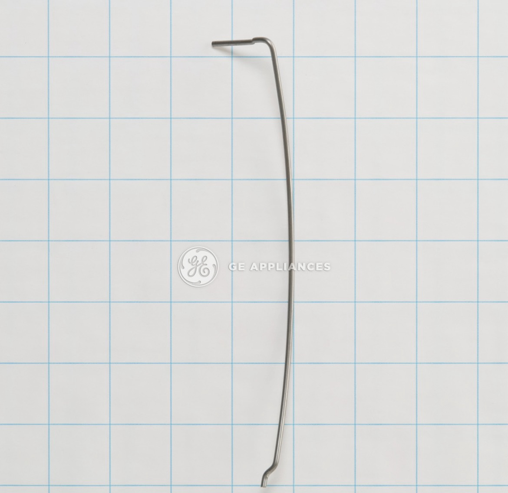
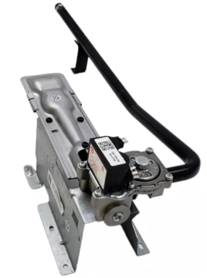
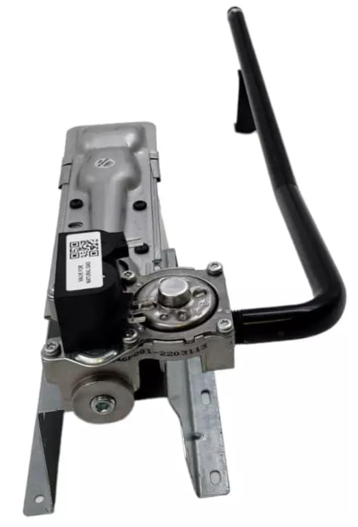
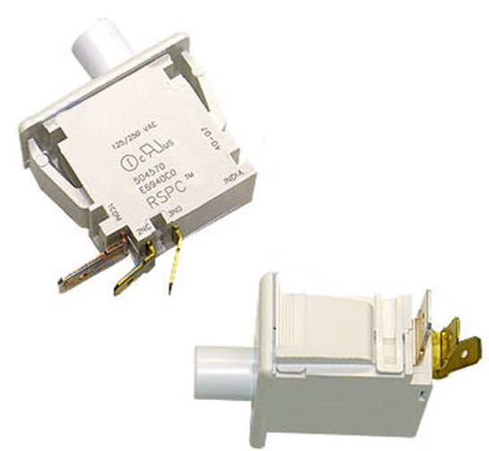

# Thermistor

## Requirements
On start key release, the SSD should reflect the inlet/outlet temperature. The drum motor should start, and the corresponding coil should turn on (gas units just turn on the heat). Opening the dryer door or deselecting the test will turn off the drum and heaters.

### No. Part
- **559C259G003**

# Sensor Rod

## Requirement
The moisture rod sensor shall provide a continuous moisture-related electrical signal to the control during sensor-dry operation, and the control shall use this signal to determine dryness progress, dynamically adjust remaining cycle time, and trigger phase transitions toward dry/ready completion while preserving safe operation and service diagnostics; if the sensor input indicates an abnormal condition, the control shall register the corresponding service-visible fault according to platform criteria without delegating interpretation to the user interface.

### No. Part
- **540B266P001**

# Gas Valve
## Requirement
The Gas Valve system shall control the delivery of gas to the dryer burner by opening only when heating is requested and all required operating and safety conditions are satisfied; the control shall energize the valve to provide the gas flow necessary for the selected drying temperature, continuously coordinate valve operation with the ignition and temperature management functions, immediately remove gas flow when a heat request is terminated or a fault condition is detected, and prevent unintended gas delivery whenever a valid activation command is not present, ensuring safe and reliable dryer heating operation.

### No. Part
- 234D3046P001

# Door Switch
## Requirement
The Door Switch system shall protect the user by continuously monitoring the dryer door status and providing open and closed state feedback to the Main Control; the control shall verify that the door is closed before allowing cycle initiation, immediately respond to a door opening event during operation by disabling functions that require a closed-door condition, maintain accurate door status monitoring throughout the cycle, and prevent operation whenever an unsafe door-open condition exists, ensuring safe dryer operation and user access protection. 

### No. Part
- 248C1157P001

