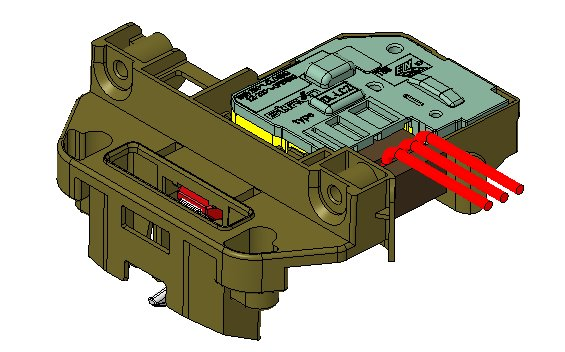
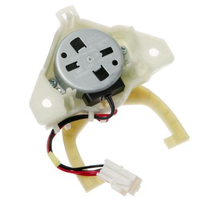
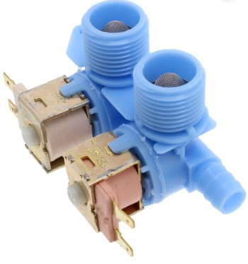
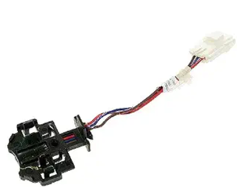

# Lid Switch/Locked
## Requirement
The Lid Lock system shall protect the user from access to moving parts by commanding and verifying lid lock transitions during hazardous operating conditions, especially when basket speed prevents a safe stop; the control shall drive the lock actuator, validate lock feedback after the defined verification delay, enforce retry and timeout logic for failed transitions, raise service faults when lock/unlock cannot be achieved, and cancel or block cycle operation whenever an unsafe unlocked-at-speed condition is detected, ensuring the appliance remains in a safe state until normal lock monitoring criteria are restored.
### No. Part
- **290D3070P002**

# DC Mode Shifter 
## Requirement
When a transition between wash and spin operation is required, the control shall command the Mode Shifter to move to the appropriate position. The motor shall not begin operation in the new mode until the shift action is completed. The Mode Shifter shall remain in the selected position throughout the active cycle. If the Mode Shifter fails to reach the requested position within the specified time, the control shall stop the cycle and report a fault condition. Cancelling the cycle shall stop any Mode Shifter movement.

### No.Part
- **253C1353G003**

 
# Water Valve
## Requirement
When a fill operation is requested, the control shall energize the corresponding Water Valve solenoid and allow water to enter the tub. The Water Valve shall remain open until the target water level is reached or a fill timeout occurs. Once the requested water level is achieved, the control shall de-energize the Water Valve and stop water flow. If the target water level is not detected within the specified fill time, the control shall close the Water Valve and report a fault condition. Cancelling the cycle or detecting a fault condition shall immediately close all water valves.

### No. Part
- 189D5366P006

# Speed Sensor
## Requirement
When motor operation is initiated, the Speed Sensor shall provide rotational speed feedback to the control. The control shall use the Speed Sensor input to monitor and regulate motor performance during wash and spin operations. If the Speed Sensor signal is not detected or becomes invalid while the motor is running, the control shall stop motor operation and report a fault condition. Cancelling the cycle or entering a fault state shall stop motor operation and ignore further Speed Sensor feedback until a new cycle is started.

### No. Part
- 540B355P004

