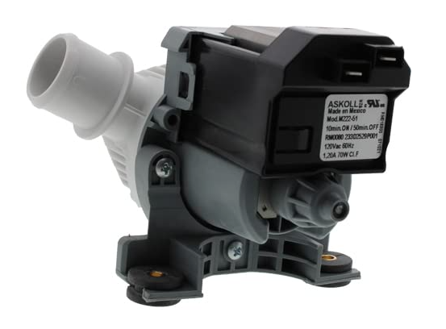
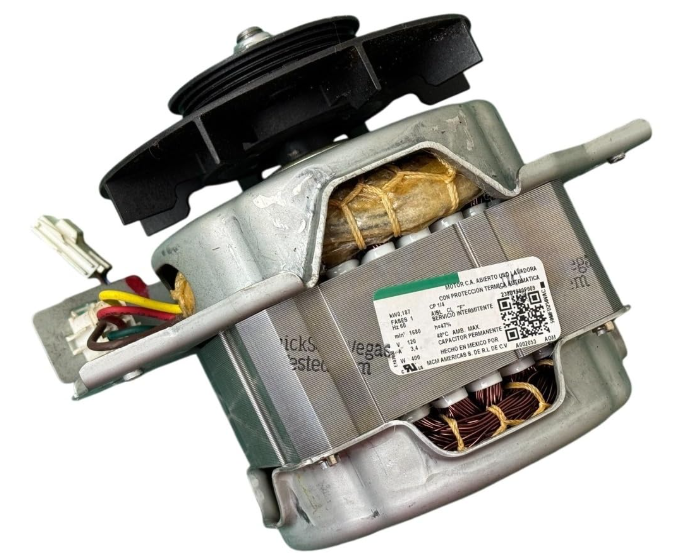
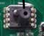
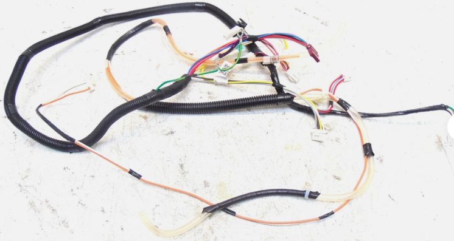
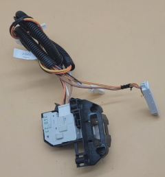

# **Washer Requirements**

# Lid Lock

## Requirement
The Lid Lock system shall protect the user from access to moving parts by commanding and verifying lid lock transitions during hazardous operating conditions, especially when basket speed prevents a safe stop; the control shall drive the lock actuator, validate lock feedback after the defined verification delay, enforce retry and timeout logic for failed transitions, raise service faults when lock/unlock cannot be achieved, and cancel or block cycle operation whenever an unsafe unlocked-at-speed condition is detected, ensuring the appliance remains in a safe state until normal lock monitoring criteria are restored.

### No. Part

- **228C2426P001**

---

# Lid Switch

## Requirement
The Lid Switch shall provide lid position feedback to the Main Control Board indicating whether the washer lid is open or closed. The control shall use this status to enable or prevent agitation and spin operations, pause cycle execution when the lid is opened during operation, resume permitted functions when the lid is closed, and support safety-related monitoring to prevent washer operation under unsafe lid conditions.

### No. Part

- **228C2426P001**

 

---

# DC Mode Shifter 

## Requirement
When a transition between wash and spin operation is required, the control shall command the Mode Shifter to move to the appropriate position. The motor shall not begin operation in the new mode until the shift action is completed. The Mode Shifter shall remain in the selected position throughout the active cycle. If the Mode Shifter fails to reach the requested position within the specified time, the control shall stop the cycle and report a fault condition. Cancelling the cycle shall stop any Mode Shifter movement.

### No.Part

- **253C1353G003**

---
 
# Water Valve

## Requirement
When a fill operation is requested, the control shall energize the corresponding Water Valve solenoid and allow water to enter the tub. The Water Valve shall remain open until the target water level is reached or a fill timeout occurs. Once the requested water level is achieved, the control shall de-energize the Water Valve and stop water flow. If the target water level is not detected within the specified fill time, the control shall close the Water Valve and report a fault condition. Cancelling the cycle or detecting a fault condition shall immediately close all water valves.

### No. Part

- **189D5366P006**

---

# Speed Sensor

## Requirement
When motor operation is initiated, the Speed Sensor shall provide rotational speed feedback to the control. The control shall use the Speed Sensor input to monitor and regulate motor performance during wash and spin operations. If the Speed Sensor signal is not detected or becomes invalid while the motor is running, the control shall stop motor operation and report a fault condition. Cancelling the cycle or entering a fault state shall stop motor operation and ignore further Speed Sensor feedback until a new cycle is started.

### No. Part

- **233D2227P001**

---

# Drain Pump 

## Requirement
The Drain Pump shall receive control commands from the Main Control Board to remove water from the wash basket during drain and spin operations. The pump shall operate whenever a drain function is requested, shall support water evacuation during overflow protection conditions, and shall continue operating until the required water level condition is achieved.

### No.Part

- **233D2529P001**

---

# Washer Drive Motor

## Requirement
The Washer Drive Motor shall receive control signals from the Main Control Board to provide the mechanical power required for washer agitation and spin operations. The motor shall support the commanded operating mode and speed, shall enable basket rotation according to the selected cycle requirements, and shall operate in coordination with the Speed/Hall Sensor and Mode Shifter to ensure proper wash and spin performance. The control system shall continuously monitor motor operation and shall detect abnormal operating conditions that could prevent the requested motion from being achieved.

### No.Part

- **233D1980P008**

---

# Pressure Sensor

## Requirement
The Pressure Sensor shall provide continuous water level feedback to the Main Control Board by monitoring the air pressure generated within the wash tub pressure chamber. The sensor shall enable the control system to determine fill levels, monitor overflow conditions, support load and water level management functions, and verify proper draining of the washer. The Main Control Board shall use the pressure sensor feedback to control cycle operation, detect abnormal water level conditions, and initiate protective actions when unsafe or unexpected water levels are detected

### No.Part

- The pressure sensor is also mounted to the main board.

 

---

# Harness Main Washer
## Requirement
The system shall provide electrical connectivity between the main control board and all washer subsystems, including sensors, actuators, motor drive, water inlet valves, drain pump, and lid lock assembly.

### NO.Part
- **233D2626G002** si existe

---

# Harness Lid Lock/Switch
## Requirement
The system shall provide electrical connectivity between the main control board and the lid lock assembly to enable lid status monitoring and lid locking functions during operation.

### NO.Part
- **233D2627G003** si existe

---

# Harness Valve 
## Requirement
The system shall provide electrical connectivity between the main control board and the water inlet valve assembly to enable controlled water filling operations.

### NO.Part
- **233D2634G004**

---

# Harness Pump
## Requirement
The system shall provide electrical connectivity between the main control board and the drain pump to enable pump operation during drain cycles.

### NO.Part
- **233D2635G002**

---